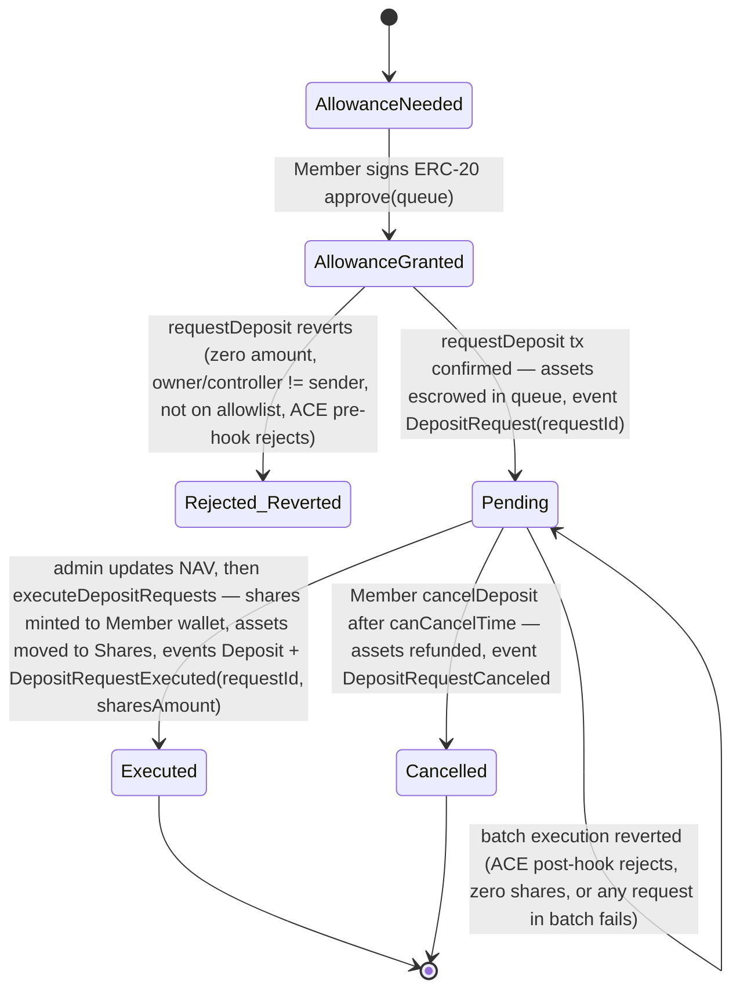

# 02 — Enzyme Onyx (vault infrastructure)

Research note for Helm Phase 0. Verification date for every **Verified capability** in this note: **2026-10-08**.
Scope: what Onyx provides for the **Vault Deposit**, **Redemption** and **Vault Position** journeys, what it does not provide, and what Cyclone, Helm/Business and Enzyme must each supply before the vault accepts real funds.

## Evidence labels

| Label | Meaning in this note |
| --- | --- |
| **[Verified]** | Verified capability. Read on the cited public source (IDs `S1`–`S36` below) on 2026-10-08. |
| **[Correspondence]** | Provider correspondence recorded in `inputs/Business.md` §2. Not verified. |
| **[Recommended]** | Recommended design for Helm. Not a provider statement. |
| **[TBD]** | Assumption, or an open item that needs Enzyme or Business confirmation. |

How the evidence was gathered: GitBook pages were read as Markdown (the `.md` version of each page, listed in `https://docs.enzyme.finance/llms.txt`). GitHub was read through the GitHub API at `main` = commit `3c8c3c9` (2026-09-09). Audit PDFs were downloaded from the repository and their text was extracted. The public API's OpenAPI document is embedded in its reference page, and one unauthenticated `GET /chains` call was made. Nothing was signed up for, no wallet was connected, and Enzyme was not contacted.

---

## 1. Summary

**What Onyx is.** **[Verified]** Onyx is a **tokenisation, subscription and accounting layer**, not a strategy. Its contracts issue ERC-20 shares, run deposit and redeem queues, store an admin-reported share value and track fees. The protocol docs state it does **not** "monitor, track, or restrict what actually happens with the tokenized value" (S22). Deposited assets are withdrawn by the Vault Owner or Admins to a **Management Wallet**. From there a **Manager** runs the strategy off-protocol (S2, S9). Any yield depends entirely on that Manager. Onyx cannot be presented as a ready staking or yield product.

**What is verified and fit for Helm**
- **Deposits can be limited to approved addresses.** **[Verified]** The async deposit queue has a `depositRestriction` with three modes: `None`, `ControllerAllowlistInternal` and `ControllerAllowlistExternal` (an on-chain address-list contract). The sync deposit handler has its own allowlist. Chainlink ACE policy hooks (KYC credential, sanctions list, volume caps, pause) can also be attached to deposits, redemptions and transfers (S12, S13, S18, S26, S33). This lets Helm admit only Members who have cleared onboarding, KYC if applicable, and sanctions screening.
- **Share transfers can be restricted.** **[Verified]** Transfers can be fully disabled, or limited by sender and recipient allow/deny lists (S12, S17, S25).
- **Flows are documented.** **[Verified]** Approve → request deposit (async queue, admin executes after a NAV update), with an optional synchronous instant deposit. Redemption is request → admin execution only (S9–S11, S25).
- **Integration tooling exists.** **[Verified]** The TypeScript SDK `@enzymefinance/onyx-sdk` (v5.0.0, BUSL-1.1) handles writes. A public, read-only REST API with no authentication handles indexed reads and history (S29, S30).
- **A Sepolia test deployment exists.** **[Verified]** It is in the SDK environment package and in the API chain list (S30, S35).

**Not verified, or in conflict with correspondence**
- **[TBD]** Commercial terms. The public pricing page shows **USD 2K/month** (or USD 18K/year), or **20% revenue share with a USD 6,000 annual minimum, paid upfront**. It shows **no USD 5,000 deployment fee and no 0.25%-of-AUM option** (S1). Both of those appear only in correspondence.
- **[TBD]** Lead times, MLA content, onboarding-form fields and SLAs. None are published.
- **[TBD]** How Enzyme's **global upgrade authority** over all vault proxies is governed (S24, S34). Docs call the vault "self-custodial", but the audit says the global owner "could fully drain the system".

**Top blockers before accepting real funds**
1. **No strategy, Manager or Management Wallet has been chosen.** Someone must run the strategy, report NAV, and return liquidity to the vault for redemptions. Onyx does none of this.
2. **Vault Owner and Admin custody.** The protocol treats Owner and Admins as **fully trusted**: they can set arbitrary share prices, mint or burn supply, and withdraw every token held in `Shares` (S27, S34). The owning legal entity, a multisig owner, and admin key controls must be decided and reviewed.
3. **MLA and commercial agreement.** The BUSL-1.1 licence permits only non-production use without a commercial agreement (S32). The pricing in correspondence differs from the public page.
4. **Deposit-admission and transfer configuration must be fixed at deployment.** This covers the allowlist type and owner, the transfer policy, minRequestDuration, sync versus async, assets and fees. Changes to Advanced Configuration and list attachment currently **go through Enzyme** (S17, S18).
5. **An operating process is required.** NAV is manual by default, and queued deposits and redemptions sit pending until an Admin executes them. A batch reverts if any one request in it fails (S26). Helm needs staffed operations or the NAV automation (Chainlink CRE plus Octav or 1Token subscriptions, S15).
6. **Security review of the actual deployment.** The audits cover the core modules, but `SharesDeployer.sol` appears in no audit scope found, and QA reviews are explicitly not audits (S34). The Helm vault configuration and integration need their own review.
7. **Chain choice.** Arbitrum is a **live mainnet** (`Kind.LIVE`). A "test vault on Arbitrum" would therefore hold real assets. Sepolia is a testnet (S35).

---

## 2. Capability table

| # | Helm requirement | Evidence (what the source shows) | Label | MVP impact |
| --- | --- | --- | --- | --- |
| 1 | Vault infrastructure vs strategy | "Set of EVM-compatible smart contracts to tokenize on- and off-chain value… not asset management itself" (S22). "Onyx does not monitor, track, or restrict how the tokenized value or assets are managed" (S2). Enzyme "has no control over the funds and the strategy" (S6). | [Verified] | **Blocker**: a strategy and Manager must be approved separately. Helm terms must not imply a yield. |
| 2 | Supported chains (production) | SDK docs and FAQ list Ethereum (1), Arbitrum One (42161), Base (8453) and Plume (98866) (S29). The SDK environment package also has BSC, MegaETH (LIVE), Rayls (`Status.PENDING`), Sepolia and Base Sepolia (TEST) (S35). The API `/chains` endpoint also lists Avalanche (S30). The deploy script supports mainnet, arbitrum, avalanche, base, bnb_smart_chain, ethereum_sepolia, mega_eth, plume and rayls (S32). The product page markets "Canton, Rayls, EVM" (S1). One vault lives on one chain (S7). | [Verified] | Choose one chain. Docs differ on the exact list, so confirm with Enzyme. Arbitrum is listed everywhere. |
| 3 | Test environment | Correspondence: "standard test vault on Sepolia or Arbitrum". Sepolia v1 contracts are deployed (`Kind.TEST`, `Status.LIVE`) (S35). Arbitrum is `Kind.LIVE` (S35). | [Correspondence] + [Verified] | Use **Sepolia** for the thin slice. An Arbitrum "test" vault would mean real funds, which needs Business approval. |
| 4 | Deposit asset | Any ERC-20, one or several Deposit Assets. Redemption Assets may differ (S8). Each queue handles one `asset` (S25). Fee-on-transfer, rebasing and re-entrant tokens are not supported (S27). NAV automation needs a stable-rate asset such as USDC (S15). | [Verified] | **[Recommended]** One stablecoin, such as native USDC on the chosen chain, for deposit, redemption and fees. **[TBD]** Business picks the asset. |
| 5 | Share token standard | Shares are ERC-20 with a custom ticker (S6). **Not ERC-4626**: Enzyme "opted for our own protocol" (S31). Queues are "ERC7540-like", "partially compatible with ERC-7540" (S25). | [Verified] | Helm must not assume ERC-4626 tooling. Use the SDK and ABIs. |
| 6 | NAV / price per share | Non-continuous accounting. NAV is updated at checkpoints, not live (S14). Share value = (tracked + untracked positions − unclaimed fees) / total shares, stored with a timestamp. "Consumers [must] assess the staleness" (S25). Asset rates are set by admin with an expiry (S25, S29). | [Verified] | Helm must show the share-price timestamp and a "valued as of" label. |
| 7 | Who updates NAV | Vault Owner or Admin reports Portfolio Value in an on-chain transaction (S14). Optional Enzyme-built automation via Chainlink CRE runs every 24 h by default, with data from Octav or 1Token. Enzyme is "not responsible for the accuracy… of data supplied by third-party" providers (S15). | [Verified] | **Blocker (operations)**: name a NAV owner and cadence. Automation adds third-party subscriptions and a ≥30-minute no-activity window (S15). |
| 8 | Deposit flow | Approve the ERC-20 to the queue → `requestDeposit` escrows assets → admin updates NAV → admin `executeDepositRequests` mints shares directly to the controller (S9, S20, S29, S33). | [Verified] | Two Member-signed transactions on the vault chain. Shares arrive only after admin execution, so deposits stay pending until then. |
| 9 | Instant deposits | `SyncDepositHandler`: shares are minted at the cached price in the same transaction. A "deposit window" (`maxSharePriceStaleness`) blocks deposits when the NAV is stale. It is "not recommended" for volatile portfolios (S10). It has its own optional allowlist (S18, S34 QA). | [Verified] | Better user experience, but it depends on regular NAV updates. **[Recommended]** Use async for the MVP unless the strategy is low-volatility and NAV is automated. |
| 10 | Restrict deposits to approved / KYC'd addresses | Queue `depositRestriction` with `None`, `ControllerAllowlistInternal` or `ControllerAllowlistExternal` (S30, S33). Whitelisting: "only wallet addresses explicitly added… will be able to deposit" (S12). Optional Chainlink ACE policies, e.g. "require that a wallet holds a verified identity credential (such as KYC or AML status)" and allow/deny lists (S13). "Enzyme does not enforce KYC… at the protocol level" (S12, S31). | [Verified] | **Feasible.** Helm adds the Member's wallet address to the list after its own checks. Who controls the list and how fast it updates is a design decision (§5). |
| 11 | Depositor identity constraint | Contract requires `_owner == msg.sender` and `_owner == _controller` for deposit and redeem requests (S33). | [Verified] | Helm's backend **cannot deposit or redeem on a Member's behalf**. The Member's own wallet (Privy) signs, and that address must be on the allowlist. |
| 12 | Redemption flow | Async queue only. Member requests → shares escrowed → admin updates NAV, makes sure the vault holds enough liquidity, then executes. Each request executes **in full**. The admin chooses whether and when to execute. Requests cannot be rejected, only ignored. The Member can cancel after `minRequestDuration` (S11, S19, S25, S33). | [Verified] | Redemption is **not instant** and has **no protocol SLA**. Helm must publish an operational target and show the stages. |
| 13 | Lockups, gates, windows | No built-in rounds or epochs (S25). `minRequestDuration` limits **cancellation**, not execution (S25, S33). Gates are admin discretion, available liquidity, optional ACE pause or volume policies (S13), and the sync deposit window (S10). No redemption lockup or notice-period module was found. | [Verified] | Any lockup or notice period is a **business rule** run by operations and disclosed in terms. **[TBD]** Ask Enzyme whether a custom module is possible. |
| 14 | Fees | Management fee (annualised continuous flat rate), performance fee (flat rate above high-water mark, optional hurdle rate), entrance and exit fees (flat %). Every fee and recipient is updatable. An unset entrance or exit recipient burns the fee pro rata. Fees accrue as debts and an admin distributes them in the fee asset. Payment splitter is supported (S16, S25, S29). | [Verified] | **[TBD]** Business decides the fee schedule and recipient entity. Fee changes do not auto-settle (S25), so changes need a procedure. |
| 15 | Administrative roles | One Owner (two-step transfer, "Accept Ownership"), many Admins, limited admins via `LimitedAccessLimitedCallForwarder`. Owner and Admins are "fully-trusted" (S21, S23, S33). | [Verified] | See §5. **Blocker**: owner entity and multisig. |
| 16 | Custody of invested capital | Assets in `Shares` are reachable only through admin `withdrawAssetTo`. The Management Wallet is "not directly connected or integrated with the Vault". Any wallet type works: EOA, MPC, Safe, cold (S5, S19, S25). | [Verified] | Custody of the strategy wallet sits **outside Onyx**. The Manager's custody and controls need their own review. |
| 17 | Upgradeability / timelocks | "All contracts are deployed as upgradable proxies… upgradable by the global owner (set on `Global`)" (S24). The audit lists the Global owner as "Fully trusted… Could fully drain the system" (S34). "Enzyme may require Vault upgrades" (S6). No timelock was found in docs or `src/`. | [Verified] | **Blocker (security / legal)**: the MLA must cover upgrade governance and notice. **[TBD]** Ask whether a non-upgradeable or self-governed setup is possible; S24 says it "is possible". |
| 18 | Transaction SDK | `@enzymefinance/onyx-sdk` plus `onyx-environment`, `onyx-abis` and viem. Functions include `Asset.approve`, `ERC7540LikeDepositQueue.requestDeposit` / `requestDepositReferred` / `cancelDeposit` / `getDepositRequest`, `ERC7540LikeRedeemQueue.requestRedeem` / `cancelRedeem` / `getRedeemRequest`, and `Shares.sharePrice`. The page warns "APIs may change between versions" (S29, S35). | [Verified] | Usable from the Helm frontend with the Privy wallet as the signer. Pin the version. |
| 19 | Read / data API | Public REST API: "read-only. No authentication required. Rate limited per IP", about 10 s cache (S29, S30). Includes `/vaults/{id}/activities` with cursor pagination and type filters, `/vaults/{id}/deposits/{wallet}` and `/vaults/{id}/financials` (§6). | [Verified] | Good for display and reconciliation cross-checks. No SLA is published. |
| 20 | Push notifications | No webhooks or subscriptions appear in the docs or the OpenAPI document. No subgraph is documented. | [Verified (absence in sources read)] | **[Recommended]** Helm polls the API and indexes chain events itself (§6). |
| 21 | Referral tag on deposit | `requestDepositReferred(assets, controller, owner, bytes32 referrer)` emits `DepositRequestReferred(requestId, referrer)`. Sync `depositReferred` emits `Deposit(..., referrer)` (S33). The API activity enum has no "referred" type (S30). | [Verified] | Optional attribution tag only. **Not** a Genealogy source (see §6). |
| 22 | Cross-chain deposits | Via Chainlink CCIP, typically 20–30 minutes, with per-depositor `DepositorWallet` contracts (S26-cc, S34). | [Verified] | **[Recommended]** Out of MVP scope. Use one chain. |
| 23 | Investor front-end | Enzyme "delivers a dedicated interface for your Vault". White-label "to be integrated soon" (S3, S20). | [Verified] | Helm builds its own UI with the SDK. The Enzyme interface could serve as a fallback or ops check. |
| 24 | Rollout access | "Access to Onyx will be gated during its first months of rollout" (S3). Admin App login is "gated with an email shared to Enzyme prior Vault deployment" (S17-login). | [Verified] | Give Enzyme the admin emails and owner address early. |
| 25 | Audits | ChainSecurity audits of the core (Dec 2025), CCIP wallet (May 2026) and Chainlink ACE (Jul 2026), plus three ChainSecurity QA reviews (§7). Bug bounty on Immunefi, max USD 200,000 (S36). | [Verified] | Coverage maps to modules, not to Helm's configuration. See §7. |
| 26 | Licence | BUSL-1.1. "Production use of the Licensed Work requires a commercial agreement with Licensor". Change Date 2029-01-01 → GPL-3.0 (S32). npm packages are BUSL-1.1 (S35). | [Verified] | MLA is a hard prerequisite for production. |
| 27 | Deployment and handover tasks | Docs: client gives requirements → Enzyme deploys → client logs in to the Admin App, accepts ownership, checks settings → runs strategy (S3, S21). Correspondence: test vault → configuration → package → MLA → deployment → handover (Business.md §2). | [Verified] + [Correspondence] | Matches the correspondence sequence. The onboarding form and MLA drafts were not supplied. |
| 28 | Lead times | None published. "Bridging… 20–30 minutes" is the only timing found, and it is cross-chain only (S26-cc). | [TBD] | Ask Enzyme for deployment and handover lead time. |
| 29 | Pricing | Public: Standard **USD 2K/month** ("USD 18k per Year (USD 1.5K/mon)", 25% off). Incremental **"20% rev sharing on vault fees (USD 6,000 annual minimum, paid upfront)"**. "6 Months Free for vaults deployed by 15 Dec" (year not stated) (S1). | [Verified] vs [Correspondence] | See §9. Reconfirm in the MLA. |

Source note for rows 22 and 24: "S26-cc" means the cross-chain pages listed under S26. "S17-login" is the Admin App log-in page listed under S17.

---

## 3. Deposit state machine (as documented)

### 3a. Async queue (`ERC7540LikeDepositQueue`): the default

**[Verified]** from S9, S19, S20, S25, S29 and S33 (contract source at `main`).

After `Executed`, the Owner or Admin calls `withdrawAssetTo` (Admin App "Funds Transfer") to move assets to the Management Wallet. This emits `AssetWithdrawn` (S19, S33). The money then leaves the vault and enters the strategy.

Notes:
- **[Verified]** No separate claim step exists in the current queue code. Shares are minted to `request.controller` during execution (S33). The generic protocol diagram mentions a "possibly separate claim step", which does not apply to this queue (S25).
- **[Verified]** Requests are identified by `requestId`, which increments per queue and starts from 1 (S33).
- **[Verified] Documentation inconsistencies.** The Investor Interface page says deposits can be cancelled "at any time, unless the Vault Owner has defined a minimum holding period" (S20). The contract only allows cancellation after `canCancelTime = request time + minRequestDuration` (S33). The API schema describes `minRequestDuration` as the time "before execution" (S30), but the contract uses it to gate cancellation only. **Use the contract behaviour.**
- **[Verified]** The audit advises that `minRequestDuration` "should always be set to a positive value". Otherwise executions can fail when controllers cancel first (S34, note 8.1.7).

### 3b. Sync handler (`SyncDepositHandler`): optional

**[Verified]** from S10, S33 and S34 QA. `deposit(amount)` or `depositReferred(amount, referrer)` succeeds only when the amount is above zero, the depositor is on the optional allowlist, the share price is within `maxSharePriceStaleness`, and the asset rate has not expired. Shares are then minted in the same transaction and `Deposit(depositor, assetAmount, sharesAmount, referrer)` is emitted. Otherwise the whole transaction reverts. It can run alongside the queue or replace it, and can use different deposit assets (S10).

### 3c. Helm-side states (Recommended)

**[Recommended]** Helm records `approval_submitted → approval_confirmed → request_submitted → request_confirmed (Pending) → executed | cancelled | failed_tx`, plus `stale_pending` when a request passes the published processing target. "Submitted" means Helm has a transaction hash. "Confirmed" means a receipt with the required confirmations. "Synchronised" means the Onyx API reflects the change. A Vault Position counts only from `executed`.

---

## 4. Redemption state machine (as documented)

**[Verified]** from S11, S19, S20, S25 and S33.

```mermaid
stateDiagram-v2
    [*] --> Holding: Member wallet holds shares
    Holding --> Rejected_Reverted: requestRedeem reverts (zero shares, owner/controller != sender, ACE pre-hook rejects)
    Holding --> Pending: requestRedeem confirmed — shares escrowed in redeem queue, event RedeemRequest(requestId)
    Pending --> Cancelled: Member cancelRedeem after canCancelTime — shares returned, event RedeemRequestCanceled
    Pending --> Pending: admin ignores (cannot reject)
    Pending --> AwaitingLiquidity: admin updates NAV; Shares lacks enough redemption asset
    AwaitingLiquidity --> Executed: Manager transfers liquidity to Shares, admin executeRedeemRequests — exit fee settled, shares burned, asset sent to Member wallet, events Withdraw + RedeemRequestExecuted(requestId, assetAmount)
    Pending --> Executed: admin updates NAV and executes (liquidity already sufficient)
    Executed --> [*]
    Cancelled --> Holding
```

Notes:
- **[Verified]** Each request executes in full, with no partial fills (S11). The redeemed asset is paid to the requesting wallet on the vault chain (S8, S33).
- **[Verified]** No allowlist applies to redeem requests unless an ACE pre-request or post-execute hook is attached (S26, S33). An allowlist that blocks new deposits therefore does not stop existing holders from redeeming. **[Recommended]** Keep it that way unless legal review requires otherwise. Any restriction on a flagged Member's redemption needs legal authority; Onyx gives no freezing power beyond policy hooks and admin discretion.
- **[TBD]** `AwaitingLiquidity` is an operational state Helm infers. It is not on-chain. The protocol only expects the Manager to transfer "the shortfall" before execution (S25).

---

## 5. Roles and permissions

| Role | Who (proposed) | Powers (as documented) | Trust per audit/docs | Label |
| --- | --- | --- | --- | --- |
| Global owner (`Global`) | Enzyme. On-chain owner addresses are listed per network in the SDK env, e.g. Arbitrum `0x53f6…e5bc` (S35) | Controls factories and "proxy upgrades" of all Shares and components (S24) | "Fully trusted… Could fully drain the system" (S34) | [Verified] |
| Vault Owner | **[TBD]** Helm/AlphaWave operating entity. **[Recommended]** A Safe multisig with no hot keys | Single owner. Adds and removes Admins. Can perform any admin action. Two-step transfer ("Accept Ownership") (S21, S23, S33) | Fully trusted (S23) | [Verified] |
| Vault Admin | **[TBD]** Fund operations wallet(s) | NAV/asset-rate updates, execute deposit and redeem queues, `withdrawAssetTo`, set fees and recipients, set handlers, validators, hooks and allowlist mode, distribute fees. Cannot manage the Admin list (S17, S23, S33) | Fully trusted. Can "inflate/deflate shares supply… set arbitrary share prices… withdraw all ERC20 tokens held in Shares" (S27) | [Verified] |
| Limited admin | e.g. CRE NAV automation (`CreWorkflowConsumer`) | Calls only whitelisted `(target, selector)` pairs through `LimitedAccessLimitedCallForwarder`, e.g. `updateShareValue` selector `0x189ee485` (S15) | "Fully trusted in the scope they have been assigned to" (S34) | [Verified] |
| Manager / Management Wallet | **[TBD]** Strategy manager (could be the Owner, an Admin or a third party) | Runs the strategy outside Onyx. Returns liquidity to `Shares` for redemptions and fees (S4, S5, S25) | Outside the protocol trust model. Custody per the chosen wallet stack | [Verified] |
| Address-list owner | **[TBD]** `OwnableAddressList`: any chosen wallet. `SharesOwnedAddressList`: vault Owner or Admins (S18) | Add or remove allowlisted addresses (one at a time or in batches in the Admin App) | Owner trusted (S34 QA) | [Verified] |
| ACE policy-engine admin | **[TBD]** If ACE is used | Controls the policies, their order, extractors and the default allow/reject (S26) | Outside Onyx | [Verified] |
| Fee recipients | **[TBD]** Business entity / split | Receive distributed fees | "Minimally trusted" (S34) | [Verified] |
| Enzyme team (operational) | Enzyme | Changes Advanced Configuration ("currently, changes can only be made by the Enzyme team") and attaches or changes address lists or validators (via support) (S17, S18) | Operational dependency | [Verified] |
| Member (depositor) | Member's Privy wallet | `requestDeposit` / `requestRedeem` / cancel. Must be `msg.sender` = owner = controller (S33) | Untrusted (S23, S34) | [Verified] |

**Timelocks:** **[Verified]** None documented, and no timelock contract exists in `src/` at `main` (S32).

**[Recommended] controls**
- Owner on a Safe multisig, with signers from Business, not Cyclone alone.
- A separate Admin wallet for queue execution, NAV and list updates. For routine NAV updates, use a limited admin (forwarder) scoped to specific selectors rather than a full Admin key.
- Keep the Management Wallet separate from the Owner wallet (S5 allows either).
- Helm's backend should hold **no** Owner or full Admin key. If Helm automates allowlist additions, use a dedicated `OwnableAddressList` whose owner is a policy-constrained wallet. That wallet can then only change list membership, not the vault. **[TBD]** Confirm with Enzyme that an external list can be attached at deployment.

---

## 6. Data and indexing options for Helm reconciliation

| Option | What is available | Strengths | Limits | Label |
| --- | --- | --- | --- | --- |
| Onyx public API | `GET /vaults/{id}`, `/vaults/{id}/configuration`, `/vaults/{id}/deposits`, `/vaults/{id}/deposits/{wallet}` (shares, currentValue, depositedTotalValue, redeemedTotalValue, since, …), `/vaults/{id}/activities` (cursor, `limit` 1–100, `from`/`to`, `activityTypes` such as `deposit_requested`, `deposit_cancelled`, `deposit_executed`, `redeem_requested`, `redeem_cancelled`, `redemption_executed`, `share_value_updated`, `asset_withdrawn`, `sync_deposit`, `fee_settled`, …; each item carries `transactionHash`, `blockNumber`, `requestId`), `/vaults/{id}/financials` (time series), `/vaults/{id}/address-lists`, queue components with `?depositor=` (S30) | No authentication. Indexed history. About 10 s cache (S29) | Rate limit per IP with no published quota. No SLA. Vault `id` is an internal API ID, not the contract address. No webhooks | [Verified] |
| On-chain events via RPC | Queue: `DepositRequest`, `DepositRequestReferred`, `DepositRequestCanceled`, `DepositRequestExecuted`, `Deposit`, `RedeemRequest`, `RedeemRequestCanceled`, `RedeemRequestExecuted`, `Withdraw`, plus config events (`DepositRestrictionSet`, `AllowedControllerAdded`/`Removed`, …). `ValuationHandler.ShareValueUpdated(netShareValue, …)`. `Shares.AssetWithdrawn`, `AdminAdded`/`Removed`, ERC-20 `Transfer`. Address lists: `ItemAdded`/`ItemRemoved` (S33, S34 QA) | Authoritative. No dependency on Enzyme's indexer | Helm must run its own indexer and RPC. Address-list membership "is no way to enumerate… on-chain"; it must be indexed from events (S34 QA) | [Verified] |
| On-chain reads via SDK | `getDepositRequest`, `getRedeemRequest`, `Shares.sharePrice` (price, timestamp), `Asset.getBalanceOf`, `isInDepositControllerInternalAllowlist` (S29, S35) | Real-time point checks | RPC load. Current state only (S29) | [Verified] |
| Admin App | Queues, depositors, NAV, fees views (S19) | No build needed for ops | Manual. No export documented | [Verified] |
| Subgraph / webhooks | Not found in any source read | — | — | [Verified (absence)] |

**[Recommended] Helm reconciliation design**
- **Authoritative record.** On-chain state on the vault chain is the record for Vault Deposits, Redemptions and Vault Positions (PRD). Helm indexes the queue, `Shares` and `ValuationHandler` events from the deployment block, at a confirmation depth set per chain (**[TBD]**). It cross-checks hourly and daily against API `/activities` and `/deposits/{wallet}`.
- **Deduplication keys.** Requests use `(chainId, queueAddress, requestId)`. Event rows use `(chainId, txHash, logIndex)`. Member mapping uses `(chainId, walletAddress) → Helm member ID`. A wallet must map to exactly one Member, because the allowlist and the shares are both keyed by wallet.
- **Daily invariant check.** Sum of Helm Vault Positions = `Shares.totalSupply` minus shares held by non-Member addresses: escrow in the redeem queue, existential shares, fee recipients. Pending escrow in the deposit queue should equal the sum of `Pending` requests.
- **Shares must not move off-book.** With transfers enabled, shares can move to wallets Helm does not know. **[Recommended]** Disable transfers, or allow only allowlisted recipients (S12, S17).
- **Referral tag.** `requestDepositReferred` can carry a fixed Helm channel tag. **Do not** encode Member IDs or Sponsor data on-chain, because that data is public and permanent. Genealogy stays in PillarsHub/Helm. Eligible MLM volume comes from Helm's reconciled `executed` deposits.

---

## 7. Audit table

Source: `https://github.com/enzymefinance/protocol-onyx/tree/main/audits` (S34). Commit history of the folder: 2025-07-24 → 2026-07-30.

| File | Auditor / type | Report date | Code versions reviewed | Scope (summary) | Findings (as stated) |
| --- | --- | --- | --- | --- | --- |
| `2025-09-CS--onyx-and-initial-features.pdf` (24 pp.) | ChainSecurity, full code assessment | 2025-12-05 | V1 `e74a1c0` (25 Jun 2025) → V5 `6bde048` (1 Dec 2025, "Performance Fee Update") | `Shares`, `Global`, factories, `FeeHandler`, management and performance fee trackers, `ValuationHandler`, `AccountERC20Tracker`, `LinearCreditDebtTracker`, `ERC7540LikeDepositQueue` / `RedeemQueue` (base versions), `Limited`/`OpenAccessLimitedCallForwarder`, `OneToOneAggregator`, `DeploymentHelpersLib` | 1 critical (corrected), 1 medium (corrected), 5 low (3 corrected, 2 risk accepted, including "Deposits Can Be Stolen By Inflating The Share Price" via `AccountERC20Tracker` donation). Security "high… as long as the admins follow the assumptions" |
| `ChainSecurity_EnzymeFoundation_OnyxCCIPWallet_Audit.pdf` (14 pp.) | ChainSecurity, code assessment | 2026-05-08 | `10c416b` (24 Apr 2026), `36ce682` (5 May 2026) | `DepositorWallet`, `DeterministicBeaconFactory`, `WalletsManager`. CCIP itself out of scope | 4 informational (1 corrected, 3 risk accepted, including "Events Emit No indexed Parameters") |
| `ChainSecurity_EnzymeFoundation_OnyxChainlinkACEIntegration_Audit.pdf` (28 pp.) | ChainSecurity, code assessment | 2026-07-28 | `15b8145` (19 Jun), `14a08f8` (15 Jul), `fd6bc5c` (23 Jul 2026) | ACE validators and extractors, hooks, refactored `ERC7540LikeDepositQueue` / `RedeemQueue`, `SyncDepositHandler`, `SharesMintHandler`, `SharesBurnHandler`, `AddressListsSharesTransferValidator`, ACE transfer validator, `Shares` | Lows include "Cancellation Paths Do Not Invoke Hooks" (risk accepted). Remaining items corrected or acknowledged. Highlights "absence of generic policy composition" |
| `QA/…AddressList_TransferValidator_DepositQueueList_CREConsumer.md` | ChainSecurity, **"Extensive QA… not a comprehensive security audit"** | 2026-02-10 | diff `b20a157..449ae5c` and related | Address lists, `AddressListsSharesTransferValidator`, deposit-queue external allowlist, `CreWorkflowConsumer` | Note: list members not enumerable on-chain |
| `QA/…SyncDepositHandler.md` | ChainSecurity QA | 2026-03-03 | diff `1130584..82b7370` | `SyncDepositHandler` (new) | Risk notes. Stale-pricing risk "Low, provided `maxSharePriceStaleness` is configured" |
| `QA/…CreWorkflowConsumer_NonceExpiry.md` | ChainSecurity QA | 2026-06-25 | diff `15b8145..607bfd1` | `CreWorkflowConsumer` nonce and expiry | Liveness note: a stuck nonce can halt automation (recoverable off-chain) |

**Mapping to the deployed version** (**[Verified]** via GitHub compare)
- `fd6bc5c` (the last ACE-audited commit) → `main` changes only formatting in the queues, `SyncDepositHandler` and `Shares`. It also adds **+290 lines to `src/infra/deployment/SharesDeployer.sol`**.
- `SharesDeployer.sol` does not appear in the text of any of the three audit PDFs or the QA files (text search). Treat it as unaudited on the evidence available until Enzyme says otherwise.
- Bug bounty: Immunefi "Enzyme Onyx", **Live**, max **USD 200,000**, networks in scope Ethereum, Arbitrum, Base, MegaETH and Plume (S36, page summarised by a fetch tool). **Sepolia is not in bounty scope.**
- **[TBD]** The release and commit actually deployed to Helm's vault must be stated by Enzyme. SDK releases are labelled `Version.ONE` (S35) without a commit hash.
- **[Recommended]** Ask Enzyme for (a) the deployed commit and the factory and implementation addresses, (b) confirmation that every component used by Helm (queue, sync handler if used, address list, transfer validator, `SharesDeployer`) is in audit scope, and (c) a written configuration review. Provider audits do **not** cover Helm's configuration, keys, NAV process or frontend.

---

## 8. Responsibility split: Enzyme vs Cyclone vs Helm/Business

| Area | Enzyme | Cyclone (Helm Web App/backend) | Helm/Business | Label |
| --- | --- | --- | --- | --- |
| Vault deployment and configuration | Deploys vault and components. Sets Advanced Configuration. Attaches lists and validators (S3, S17, S18) | Provides the technical requirements (asset, queues, allowlist type, transfer policy) | Approves parameters. Signs the MLA | [Verified] + [Correspondence] |
| Ownership handover | Hands over the environment. Gives an operations walkthrough ([Correspondence]) | Checks on-chain configuration matches the agreed spec | Accepts ownership from the Owner multisig (S21) | [Verified] + [Correspondence] |
| Strategy and Management Wallet | None ("no control over the funds and the strategy", S6) | None | Appoints the Manager and custody. Approves the strategy | [Verified] / [TBD] owner |
| NAV reporting | Optional automation build and maintenance (CRE). Not responsible for third-party data (S15) | Optional: monitor staleness. Alert | Owns NAV process and cadence. Data-provider subscriptions | [Verified] |
| Queue execution and liquidity | Admin App tooling (S19) | Pending-request dashboard and alerts | Operations executes. Manager returns liquidity | [Verified] / [Recommended] |
| Deposit admission | Allowlist and ACE mechanics | Adds wallets to the list after Helm checks (if delegated). Blocks the UI for non-allowlisted wallets | Defines the admission policy (KYC/sanctions applicability via legal) | [Verified] / [Recommended] |
| Member UX (approve / request / cancel / redeem) | SDK and API (S29) | Builds UI and signing via Privy. Status tracking | Terms, disclosures | [Verified] / [Recommended] |
| Indexing and reconciliation | Public API (best effort) | Indexer, reconciliation jobs, audit log | Reviews exceptions | [Recommended] |
| Fees | Fee mechanics | Shows fees | Sets schedule and recipients. Distributes | [Verified] |
| Security | Protocol audits, bug bounty, upgrades | Helm integration security review | Key management, multisig, deployment review sign-off | [Verified] / [Recommended] |
| Commercial | Pricing / MLA | — | Negotiates and pays | [Correspondence] |

---

## 9. Commercial terms check

| Item | Correspondence (Business.md §2) | Public page (S1, 2026-10-08) | Finding |
| --- | --- | --- | --- |
| Deployment fee | USD 5,000 | Not shown | **Not confirmed publicly.** Neither confirmed nor contradicted |
| Recurring, AUM option | 0.25% AUM, "6.25 bps billed quarterly on time-weighted average AUM" | Not offered. Public "Standard" plan is a flat **USD 2K/month** (USD 18K/year prepaid) | **Differs.** 6.25 bps × 4 = 25 bps/year, so the quote is internally consistent. At 0.25%, the yearly fee equals USD 18K at about USD 7.2M AUM and USD 24K at about USD 9.6M AUM. **[TBD]** Which model applies to Helm |
| Revenue share | 20% of vault management/performance fees | "20% rev sharing on vault fees (**USD 6,000 annual minimum, paid upfront**)" | 20% **confirmed**. The **USD 6,000 minimum** is not in the correspondence; confirm it. Revenue share works only if Helm charges vault fees (§2 row 14) |
| Promotion | — | "6 Months Free for vaults deployed by 15 Dec" (year not stated) | **[TBD]** Ask whether it applies to Helm |
| Large-AUM adjustment | Open to adjustment for USD 50M+ day-one AUM | Not shown | Correspondence only |

---

## 10. Open questions for Enzyme

Ordered by launch impact.

1. **Upgrade governance.** Who controls `Global` owner upgrades? Is there a timelock or notice? Can Helm's vault opt out or self-govern upgrades (S24 says it "is possible")? What MLA terms cover forced upgrades (S6)?
2. **Deployed version and audit coverage.** What commit and addresses will Helm's vault use? Is `SharesDeployer` (and any component Helm uses) covered by an audit? Will Enzyme give a configuration review letter?
3. **Test vault.** Confirm **Sepolia** for the test vault. Which test asset is used? Is Admin App access available on Sepolia? Does the public API index Sepolia vaults (it lists Sepolia in `/chains`)?
4. **Production chain and asset.** Which chains are supported for a new deployment today (the docs differ)? Which deposit asset is recommended for NAV automation?
5. **Deposit admission.** Can an `OwnableAddressList` owned by a Helm-controlled, policy-limited wallet be attached as `ControllerAllowlistExternal` at deployment? What are the batch limits and the indexer delay ("may take a short time", S18)? Do ACE KYC-credential policies need a separate Chainlink agreement and cost?
6. **Transfer policy.** Please configure shares as non-transferable, or recipient-allowlisted, at deployment.
7. **Redemption operations.** Is a notice period, gate or partial-execution module available? Is there a recommended processing cadence? How should a whole batch reverting on one failed request be handled?
8. **NAV automation.** Lead time, cost, Octav/1Token subscription requirements, the ≥30-minute inactivity window, and alerting on failure (S15).
9. **Self-service.** When will Advanced Configuration become self-service? What is the support SLA for configuration changes meanwhile (S17)?
10. **Public API.** Rate-limit quota, SLA, deprecation policy, and whether webhooks or a subgraph are planned. Confirm that the `minRequestDuration` description ("before execution") is a documentation error (S30 vs S33).
11. **SDK.** Version stability for v5.x and the changelog location. The docs page shows `addAllowedController` / `DepositRestriction.ControllerAllowlist`, but SDK v5 source exports `addDepositControllerToInternalAllowlist` and `ControllerAllowlistInternal`/`External`.
12. **Commercial.** Confirm the USD 5,000 deployment fee, the AUM option versus the public Standard plan, the USD 6,000 minimum on revenue share, the 15-Dec promotion, the MLA draft and the onboarding form (links missing from correspondence).
13. **Lead times.** Time from MLA signature to deployment and to handover, and the dependencies on Helm.
14. **Investor interface.** Will Enzyme's default interface be deployed for Helm's vault? Can it be disabled or restricted, so Members use only Helm?
15. **Inflation-attack mitigation.** Will Enzyme mint "existential shares" at deployment, and what minimum request size does it recommend (S27, S34)?

---

## 11. Evidence limitations

- **Pages read.** Every Onyx page in `llms.txt` was retrieved (user docs, protocol, SDK, FAQ) as GitBook Markdown. Figures and screenshots (for example, the Admin App Advanced Configuration tabs) were not readable as text. Some parameter options shown only in images are therefore unknown. **Impact:** low. The configuration options are confirmed from contract source instead.
- **Old links.** Several internal links point to an older host (`enzyme-finance.gitbook.io/onyx/...`, such as "Deposit Flow" and "Queued System"). These were not followed separately. They appear to be superseded by the current pages. **Impact:** low.
- **Bug bounty page.** The Immunefi page was read through a summarising fetch tool, not verbatim. Re-check the bounty scope before relying on it.
- **Risks page link.** The Risks page links `https://audit.enzyme.finance/`, which was not fetched. It is probably for Enzyme's other products. Only the GitHub `audits/` folder was used for Onyx.
- **Audit PDFs.** Text was extracted with a PDF library. Severity tables were partly garbled, so counts were cross-checked against the per-finding lists where possible. The full finding descriptions in the core audit were not all reviewed.
- **Not available publicly:** MLA, onboarding form, SLA, lead times, the actual deployed commit for a new vault, and Enzyme's handover checklist. **Impact:** these remain **[TBD]** and block the launch date, not the start of the build.
- **Code checked.** Contract behaviour quoted from `src/` is `main` at `3c8c3c9`. A deployed vault may run a different release.
- **No live checks.** No live vault was inspected. API example IDs in the OpenAPI document were not queried; only `GET /chains` was called.
- **Discovery notes.** `inputs/discovery/` contained no Enzyme/Onyx material.

---

## Sources (all verified 2026-10-08)

| ID | URL |
| --- | --- |
| S1 | https://enzyme.finance/products/onyx (product features, pricing, "6 Months Free for vaults deployed by 15 Dec") |
| S2 | https://docs.enzyme.finance/onyx-user-documentation/getting-started/quickstart/architecture |
| S3 | https://docs.enzyme.finance/onyx-user-documentation/getting-started/quickstart/deployment |
| S4 | https://docs.enzyme.finance/onyx-user-documentation/getting-started/primitives |
| S5 | https://docs.enzyme.finance/onyx-user-documentation/getting-started/publish-your-docs (Wallets page) |
| S6 | https://docs.enzyme.finance/onyx-user-documentation/enzyme-vault/overview ; …/overview/ownership |
| S7 | https://docs.enzyme.finance/onyx-user-documentation/enzyme-vault/overview/networks |
| S8 | https://docs.enzyme.finance/onyx-user-documentation/enzyme-vault/subscription/assets |
| S9 | https://docs.enzyme.finance/onyx-user-documentation/enzyme-vault/subscription/deposits ; …/deposits/asynchronous-deposits |
| S10 | https://docs.enzyme.finance/onyx-user-documentation/enzyme-vault/subscription/deposits/synchronous-deposits |
| S11 | https://docs.enzyme.finance/onyx-user-documentation/enzyme-vault/subscription/redemptions |
| S12 | https://docs.enzyme.finance/onyx-user-documentation/enzyme-vault/subscription/control |
| S13 | https://docs.enzyme.finance/onyx-user-documentation/enzyme-vault/compliance |
| S14 | https://docs.enzyme.finance/onyx-user-documentation/enzyme-vault/accounting ; …/accounting/valuation-reporting-nav ; …/administration-app/vault/markdown/updating-the-nav |
| S15 | https://docs.enzyme.finance/onyx-user-documentation/enzyme-vault/accounting/nav-automation ; …/nav-automation/automation-with-octav ; …/nav-automation/setting-up-cre |
| S16 | https://docs.enzyme.finance/onyx-user-documentation/enzyme-vault/fees ; …/fees/settlement ; …/fees/distribution ; …/fees/programmatic-split ; …/fees/hurdle-rate ; …/administration-app/vault/fee-management |
| S17 | https://docs.enzyme.finance/onyx-user-documentation/administration-app/vault/configuration ; log-in: …/administration-app/images-and-media/interactive-blocks |
| S18 | https://docs.enzyme.finance/onyx-user-documentation/administration-app/vault/address-lists-management |
| S19 | https://docs.enzyme.finance/onyx-user-documentation/administration-app/vault/subscription-management/deposit-queue ; …/redemption-queue ; …/funds-transfer |
| S20 | https://docs.enzyme.finance/onyx-user-documentation/investor-interface/overview ; …/deposits ; …/redemptions ; …/overview/wallet-connection |
| S21 | https://docs.enzyme.finance/onyx-user-documentation/onyx-general-info/onboarding-guide |
| S22 | https://docs.enzyme.finance/onyx-protocol/onyx-overview |
| S23 | https://docs.enzyme.finance/onyx-protocol/user-roles |
| S24 | https://docs.enzyme.finance/onyx-protocol/architecture/deployments-and-upgrades |
| S25 | https://docs.enzyme.finance/onyx-protocol/architecture/fees ; …/architecture/share-value ; …/architecture/shares-and-components ; …/architecture/deposit-and-redeem ; …/contract-implementations/issuance ; …/contract-implementations/fees ; …/contract-implementations/value ; …/general-flows/assets ; …/general-flows/async-deposit-and-redeem ; …/general-flows/suggested-subscription-rounds |
| S26 | https://docs.enzyme.finance/onyx-protocol/architecture/compliance ; cross-chain: …/onyx-protocol/architecture/cross-chain-deposit-and-redeem ; …/onyx-user-documentation/enzyme-vault/subscription/cross-chain-deposits-and-redemptions |
| S27 | https://docs.enzyme.finance/onyx-protocol/security/risks-and-limitations |
| S28 | https://docs.enzyme.finance/onyx-protocol/contract-addresses |
| S29 | https://docs.enzyme.finance/onyx-sdk ; https://docs.enzyme.finance/onyx-sdk/sdk ; https://docs.enzyme.finance/onyx-sdk/faq |
| S30 | https://api.onyx.enzyme.finance/reference (embedded OpenAPI "Enzyme Onyx Public API" v1.0) ; `GET https://api.onyx.enzyme.finance/chains` |
| S31 | https://docs.enzyme.finance/onyx-faq |
| S32 | https://github.com/enzymefinance/protocol-onyx (README, `LICENSE`, `LICENSES/BUSL-1.1`, `src/` tree at `3c8c3c9`) |
| S33 | https://github.com/enzymefinance/protocol-onyx/tree/main/src: `components/issuance/deposit-handlers/ERC7540LikeDepositQueue.sol`, `…/SyncDepositHandler.sol`, `components/issuance/redeem-handlers/ERC7540LikeRedeemQueue.sol`, `shares/Shares.sol`, `components/value/ValuationHandler.sol`, handler interfaces |
| S34 | https://github.com/enzymefinance/protocol-onyx/tree/main/audits (3 PDFs + `QA/` 3 Markdown files) ; compare `fd6bc5c...main` |
| S35 | https://github.com/enzymefinance/onyx-sdk (`packages/environment/src/deployments/*.ts`, `packages/sdk/src/components/issuance/ERC7540LikeDepositQueue.ts`) ; https://registry.npmjs.org/@enzymefinance/onyx-sdk (5.0.0, BUSL-1.1) |
| S36 | https://immunefi.com/bug-bounty/enzyme-onyx/ (summarised by fetch tool) |
