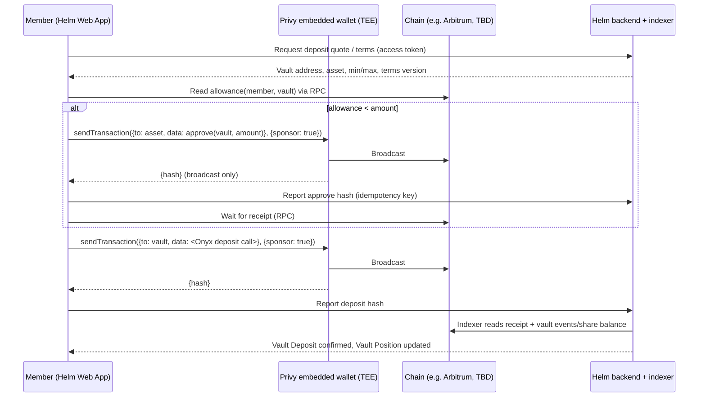

# 03 — Privy (authentication and wallets) for Helm Phase 0

- **Workstream:** Privy integration feasibility and wallet model on the confirmed stack
- **Verification date:** 2026-10-08 (all "Verified capability" items below were read on this date)
- **Method:** Read Privy public documentation (docs.privy.io, including the `/llms.txt`, `/_llms/wallets.md` and `/_llms/api-reference.md` indexes and the raw `.md` pages) and privy.io pages. No account was created, no dashboard was viewed, nobody at Privy was contacted.
- **Inputs used:** `inputs/Business.md` §1 (Privy correspondence), `inputs/Helm-Phase-0-PRD.md`, `inputs/discovery/notes-02-wallets-custody.md` (prior research of 2026-10-06; findings reused only where re-verified or labelled as prior research).

**Evidence labels**

- **Verified capability:** read on a Privy primary source on 2026-10-08; URL given.
- **Provider correspondence:** stated in `inputs/Business.md`; not independently verified.
- **Recommended design:** Cyclone's proposal for Helm.
- **Assumption/TBD:** not established by evidence; needs confirmation.

Terms follow `GLOSSARY.md` (Member, Helm member ID, Wallet Funding, Vault Deposit, Redemption, Vault Position).

---

## 1. Summary

1. **Privy covers everything Phase 0 needs from login and wallets without server wallets, signers or policies.** Members log in (email, SMS, social, passkey or external wallet), get a Privy **embedded EVM wallet**, receive Wallet Funding at its address, and sign the `approve` + vault deposit and the Redemption calls themselves from the Helm Web App using `useSendTransaction`. (Verified capability, §3.)
2. **Recommended wallet model: user-owned embedded wallet, TEE execution, no app signer, no key quorum, export left enabled.** This classifies as **non-custodial (vendor-dependent)** towards Members: neither Cyclone nor Privy can move Member funds. It also keeps Helm on the **Developer plan**, because the policy engine and key quorums, which Phase 0 does not use, are Enterprise items. (Recommended design, §2.)
3. **Arbitrum is supported** for embedded-wallet transactions (any viem chain can be configured; `arbitrum` and `arbitrumSepolia` appear in Privy's own example), for **native gas sponsorship** (app pays) and for the wallet balance and transaction-history REST endpoints. (Verified capability, §3.) The chain is still not confirmed by Enzyme/Business.
4. **ERC-4337 smart wallets are not needed.** Privy's native gas sponsorship works with the embedded wallet via EIP-7702 (`sponsor: true`), is listed under the Developer plan on the pricing page, and needs only prepaid credits. Recommend enabling it so Members holding only the funding asset (e.g. a stablecoin) can approve, deposit and redeem without first buying ETH. (Verified capability + Recommended design, §4.)
5. **Do not rely on Privy webhooks in Phase 0.** All production webhooks (user, wallet `funds_deposited`, transaction status) require the **Enterprise** plan, and the balance/transaction webhooks are documented for "wallets reconstituted server-side". Helm should **index the chain itself** (ERC-20 transfers to Member addresses, vault events, receipts) and can use Privy's balance/transaction REST endpoints as a cross-check. (Verified capability + Recommended design, §6.)
6. **Identity mapping is straightforward.** The backend verifies the Privy access token (ES256 JWT; `sub` = the Privy DID `did:privy:…`) and maps that DID 1:1 to the Helm member ID. Wallet addresses are taken from Privy server-side, never from the browser. (Verified capability + Recommended design, §7.)
7. **Biggest Privy-specific risks:** (a) a Member who loses their **only** login method loses the wallet permanently ("no recovery is possible"); (b) Stripe ownership and Bridge-backed features (fiat deposits, custodial wallets) — do not enable them; (c) the 7702 upgrade used by native gas sponsorship changes the account's code and needs a security review; (d) the business-model acceptance question is still open. (§10.)
8. **Pricing:** Core is free for 0–499 MAU (50K signatures, $1M transaction volume per month), Scale $299/month for 500–2,499 MAU, Growth $499/month for 2,500–9,999 MAU; Enterprise is custom. Gas sponsorship is billed separately (network gas plus an unpublished "convenience fee"). This matches the correspondence ("free up to 500 MAU"). (Verified capability, §9.)

---

## 2. Recommended Phase 0 wallet model

**Recommended design**

| Element | Phase 0 choice | Why |
|---|---|---|
| Wallet type | One Privy **embedded EVM wallet** (EOA) per Member, created on first login | One address per Member makes Wallet Funding and Vault Position reconciliation simple |
| Execution environment | **TEE execution** (Privy's default; the on-device mode is an "advanced" option) | Required for native gas sponsorship |
| Owner / signers | **User is the only owner; no app signer, no session/agent signer, no key quorum, no policies** | Keeps signing authority with the Member; no Enterprise policy engine needed |
| Server wallets | **None** | Phase 0 has no automated strategies; Privy's correspondence recommendation for server wallets and policies is not a Phase 0 need |
| External wallets | Allowed only as a **funding source** (Member sends from MetaMask etc. to the embedded address). Optional: external-wallet login | One Vault Wallet per Member; avoids indexing and support for arbitrary third-party wallets in the MVP |
| Smart wallets (4337) | **Off** | Native 7702 sponsorship covers the gas UX without a separate contract account |
| Gas | **Native gas sponsorship, app pays**, on the chosen chain, client-side sponsorship enabled with rate limits | Members may hold only the funding asset |
| Key export | **Left enabled** (Privy default) | Supports the non-custodial classification and gives Members an exit path |
| MFA | Offered (passkey or TOTP) and encouraged, not mandatory at MVP (**TBD** with Business) | Reduces account-takeover risk |
| Funding features | **Disabled**: fiat deposits, custodial wallets (both Bridge), card on-ramps, crypto deposit accounts | Business-model and custody risk (§8) |

**Custody classification (Recommended design, based on Verified capability)**

- **Towards Members: non-custodial (vendor-dependent).**
  - Privy: "Embedded wallets are non-custodial (self-custodial) by default", using a 2-of-2 key-share architecture where both shares are needed and Privy cannot decrypt the TEE share unilaterally. ([Security FAQ](https://docs.privy.io/security/security-faqs), 2026-10-08)
  - Privy "is never an authorized signer and holds no key that can transact". ([Supporting your users](https://docs.privy.io/user-management/users/managing-users/supporting-your-users), 2026-10-08)
  - Cyclone holds no signer, so Cyclone cannot move funds either.
  - "Vendor-dependent" because signing needs Privy's infrastructure (AWS Nitro enclaves) to be up and honest; the Member holds no independent share. Key export is the exit.
- **What would change it:** adding a session/agent signer or an app authorization key (→ hybrid), a key quorum with the app (→ non-custodial with platform veto), or server wallets (→ custodial). None of these is in Phase 0.
- **Out of Privy's scope but in the custody analysis:** the ERC-20 allowance the Member grants the vault, the Onyx vault's admin/upgrade roles, and the EIP-7702 delegation contract used for gas sponsorship (§4). These belong in the Onyx and security workstreams.

---

## 3. Capability table

| Capability | Finding | Label | Source (read 2026-10-08) |
|---|---|---|---|
| Login methods | Email OTP, SMS, Google, Apple, Twitter, Farcaster, Discord, Telegram, any OAuth, JWT/OIDC providers (Auth0, Firebase, Cognito), Ethereum/Solana wallets (SIWE/SIWS), passkeys; also guest accounts | Verified capability | [Authentication overview](https://docs.privy.io/authentication/overview), [login methods index](https://docs.privy.io/llms.txt), [wallet login](https://docs.privy.io/authentication/user-authentication/login-methods/wallet) |
| Account linking | `useLinkAccount` (`linkEmail`, `linkWallet`, `linkPasskey`, `linkGoogle`, …). One account per type except wallets and passkeys. Behaviour when the account already belongs to another user is not documented; no merge feature documented | Verified capability / TBD (merge) | [Linking accounts](https://docs.privy.io/user-management/users/linking-accounts) |
| Automatic wallet creation | `config.embeddedWallets.ethereum.createOnLogin`: `'all-users'`, `'users-without-wallets'`, `'off'` (**default `off`**). Applies **only to login via the Privy modal**, not to whitelabel login methods | Verified capability | [Automatic wallet creation](https://docs.privy.io/basics/react/advanced/automatic-wallet-creation) |
| Manual wallet creation | The React quickstart describes creating the wallet manually when needed (for whitelabel login). Exact hook not captured in this research | Verified (existence) / TBD (hook name) | [React quickstart](https://docs.privy.io/basics/react/quickstart) |
| Key model | Key generated in the TEE (AWS Nitro Enclaves), split 2-of-2: enclave (TEE) share and auth share; reconstructed only transiently inside the TEE | Verified capability (Privy's description of its own security) | [Architecture](https://docs.privy.io/security/wallet-infrastructure/architecture), [Security FAQ](https://docs.privy.io/security/security-faqs) |
| Who can sign | "The user does." Delegated signers act only if the developer configures them | Verified capability | [Security FAQ](https://docs.privy.io/security/security-faqs) |
| Recovery (TEE wallets) | Access follows the login method. Privy cannot "recover a user who has lost their only login method… No recovery is possible." Deleted accounts/archived wallets can be restored via Privy support in 1–2 business weeks | Verified capability | [Supporting your users](https://docs.privy.io/user-management/users/managing-users/supporting-your-users) |
| Recovery (on-device mode, not recommended) | Device + auth + recovery shares; automatic recovery, or user-managed via password or cloud backup (Google Drive / iCloud) | Verified capability | [User-device architecture](https://docs.privy.io/security/wallet-infrastructure/advanced/user-device) |
| MFA | SMS, TOTP, passkeys. When enrolled, required for signing, recovery, export, setting a password and changing MFA; 15-minute grace per device | Verified capability | [MFA verify overview](https://docs.privy.io/authentication/user-authentication/mfa/verify/overview) |
| Key export | `useExportWallet` / `exportWallet` opens a modal; the key is assembled on a different origin so "neither you nor Privy can ever access your user's private key". Enabled by default; can be blocked by a `DENY` policy or a 2-of-2 key quorum | Verified capability | [Export a wallet](https://docs.privy.io/wallets/wallets/export) |
| External wallets | `connectWallet` (from `usePrivy`) with optional `walletList`; MetaMask, Coinbase Wallet (EVM), Phantom, Solflare (Solana); `loginOrLink` adds the wallet to `linkedAccounts`; viem / wagmi / ethers integrations | Verified capability | [Configuring external connectors](https://docs.privy.io/recipes/react/configuring-external-connectors), [connectors index](https://docs.privy.io/_llms/wallets.md) |
| Smart wallets (ERC-4337) | Alchemy, Kernel (ZeroDev), Safe, Biconomy, thirdweb, Coinbase Smart Wallet; controlled by the embedded signer; needs a paymaster URL in the dashboard; React/React Native only; `useSmartWallets` client supports batched `calls` | Verified capability | [Smart wallets](https://docs.privy.io/wallets/using-wallets/evm-smart-wallets/overview), [usage](https://docs.privy.io/wallets/using-wallets/evm-smart-wallets/usage) |
| EIP-7702 | `useSign7702Authorization` signs 7702 authorizations with the embedded wallet | Verified capability | [EIP-7702 recipe](https://docs.privy.io/recipes/react/eip-7702) |
| Chains | Tiered support; Ethereum "includes EVM-compatible networks" at Tier 3 (create, sign, send). `PrivyProvider` `defaultChain` / `supportedChains` take viem chains; Privy's example uses `base, arbitrum, mainnet, arbitrumSepolia`; custom chains via `defineChain`; RPC override via `addRpcUrlOverrideToChain` | Verified capability | [Chain support](https://docs.privy.io/wallets/overview/chains), [Configuring EVM networks](https://docs.privy.io/basics/react/advanced/configuring-evm-networks) |
| Arbitrary contract calls | `useSendTransaction` accepts `to`, `value`, `data`, `chainId`, `gasLimit`; options `sponsor`, `uiOptions`, `fundWalletConfig`, `address`; returns `{hash}` once **broadcast** (not confirmed) | Verified capability | [Send an Ethereum transaction](https://docs.privy.io/wallets/using-wallets/ethereum/send-a-transaction) |
| Batched calls | `wallet_sendCalls` documented via REST / Node SDK (`privy.wallets().ethereum().sendCalls`), which upgrades the wallet to a Kernel account via 7702; server calls need an authorization signature. A React-hook equivalent for embedded wallets was **not found** | Verified capability (server) / TBD (React) | [Batch transactions](https://docs.privy.io/recipes/batch-transactions), [Gas setup](https://docs.privy.io/wallets/gas-and-asset-management/gas/setup) |
| Native gas sponsorship | App pays via EIP-7702 + paymasters, "powered by Alchemy"; networks include Ethereum, Arbitrum, Base and testnets including Arbitrum Sepolia; user-pays mode in USDC/USDT on Arbitrum; apps **must use TEE execution**; client-side sponsorship must be enabled in the dashboard; Privy "aggressively rate limits transactions sent from the client" | Verified capability | [Gas overview](https://docs.privy.io/wallets/gas-and-asset-management/gas/overview), [setup](https://docs.privy.io/wallets/gas-and-asset-management/gas/setup), [security](https://docs.privy.io/wallets/gas-and-asset-management/gas/security) |
| Balance / history API | `GET /v1/wallets/{wallet_id}/balance` and `GET /v1/wallets/{wallet_id}/transactions` (incoming and outgoing; chain list includes `arbitrum`; assets include `usdc`, `usdt`, `eth`; history chains do **not** list `arbitrum_sepolia`). No plan restriction stated | Verified capability | [Get balance](https://docs.privy.io/api-reference/wallets/get-balance), [Get transactions](https://docs.privy.io/api-reference/wallets/get-transactions) |
| Webhooks | Svix-signed (`svix-id`, `svix-timestamp`, `svix-signature`; Node `privy.webhooks().verify()`), at-least-once, retries over ~2 days, `idempotency_key`; **Enterprise plan in production** | Verified capability | [Webhooks overview](https://docs.privy.io/api-reference/webhooks/overview) |
| Access tokens | ES256 JWT; claims `sid`, `sub` (Privy DID), `iss` = `privy.io`, `aud` = app ID, `iat`, `exp` (~1 hour). Verify with `@privy-io/node` `verifyAccessToken` or `jose`/`jsonwebtoken` against the app's verification key from the dashboard | Verified capability | [Access tokens](https://docs.privy.io/authentication/user-authentication/access-tokens) |
| Identity tokens | Optional (dashboard toggle); `privy-id-token` cookie; claims include `linked_accounts`, `custom_metadata`, `sub`; server: `client.users().get({id_token})` | Verified capability | [Identity tokens](https://docs.privy.io/user-management/users/identity-tokens) |
| User object | `id` = Privy-issued DID (`did:privy:…`), `createdAt`, `linkedAccounts`, `wallet`, `customMetadata` (server-set JSON, ≤ 1 KB) | Verified capability | [User object](https://docs.privy.io/user-management/users/the-user-object), [Custom metadata](https://docs.privy.io/user-management/users/custom-metadata) |
| Freeze users | `POST /v1/users/<user-id>/freeze` blocks login, revokes sessions, keeps wallets unchanged. Effect on signing/export not stated | Verified capability / TBD | [Freezing users](https://docs.privy.io/user-management/users/managing-users/freezing-users) |
| Server wallets, signers, policies | Exist (owners/signers, authorization keys, key quorums, default-deny policies); **not used in Phase 0** | Verified capability (prior research, re-checked index) | [Signers overview](https://docs.privy.io/wallets/using-wallets/signers/overview), [Agent wallets](https://docs.privy.io/wallets/overview/solutions/agent-wallets) |
| Hyperliquid guide | HyperCore trading, agent wallets, Arbitrum↔HyperCore USDC bridging. **Not relevant** to an Onyx vault deposit | Verified capability | [Hyperliquid guide](https://docs.privy.io/recipes/hyperliquid-guide) |
| SOC 2 | Docs state "SOC2 Type I and Type II compliant"; audits by Cure53, Zellic, Doyensec; HackerOne bounty. **Report not reviewed** | Verified that Privy states it; certification itself not verified | [Security overview](https://docs.privy.io/security/overview) |

---

## 4. Smart wallets and gas: needed for Phase 0?

- **4337 smart wallets: no.** They add a separate contract account, a paymaster/bundler configuration and a second address to reconcile. Privy itself positions native gas sponsorship as the simpler path ("just pass `sponsor: true`", no extra bundler or paymaster) and recommends smart wallets mainly for apps that already have users with funds in them. (Verified capability: [gas overview](https://docs.privy.io/wallets/gas-and-asset-management/gas/overview).)
- **Gas sponsorship: recommended, not strictly required.**
  - Without it, each Member must also hold ETH on the chosen chain before approving, depositing or redeeming. That is an extra funding step and a common support issue.
  - With app-pays sponsorship, Helm pays network gas plus Privy's unpublished convenience fee from prepaid credits (postpaid is Enterprise only). (Verified capability: [usage billing](https://docs.privy.io/wallets/gas-and-asset-management/usage-billing/overview), [setup](https://docs.privy.io/wallets/gas-and-asset-management/gas/setup).)
  - "User pays" in USDC/USDT on Arbitrum is an alternative if Helm does not want to subsidise gas. (Verified capability.)
- **Custody and security note on 7702 (Recommended design):** native sponsorship upgrades the Member's EOA to a smart-contract delegation (the batch recipe names Kernel). The address and the Member's sole signing authority stay the same, but the delegated code now governs the account. Ask Privy which implementation and version is used and include it in the security review.
- **Abuse controls (Recommended design):** enable client-side sponsorship only for the chosen chain; rate-limit per Member in Helm's backend; monitor gas spend (Privy has a gas-spend query and usage events); set a prepaid balance cap. If client sponsorship proves abusable, the server-relayed path needs an app authorization signature, which would change the custody model — do not adopt it without review.

---

## 5. Transaction flows from the embedded wallet

All calls are signed by the Member in the browser through `useSendTransaction` (`@privy-io/react-auth`). Contract addresses, ABIs and method names come from Enzyme Onyx and are **TBD** here; nothing below asserts Onyx method names.

### 5.1 Approve + Vault Deposit

**Recommended design**

- Two sequential transactions (approve, then deposit). Skip `approve` when the existing allowance already covers the amount.
- Approve the **exact amount**, not an unlimited allowance, to limit exposure if the vault or its admin roles are compromised.
- Encode calldata with viem `encodeFunctionData` using Onyx's ABI (TBD from the Onyx SDK).
- Status model: `submitted` (hash returned) → `confirmed` (receipt status success at Helm's confirmation depth) → `synced` (Vault Position read from chain and recorded). Privy's response means only "broadcasted"; "Transactions may get broadcasted but still fail to be confirmed". (Verified capability: [send a transaction](https://docs.privy.io/wallets/using-wallets/ethereum/send-a-transaction).)
- The backend never trusts the client-reported hash alone: it re-reads the receipt and the event logs, and it dedupes on `(chain_id, tx_hash, log_index)`.
- If the Member closes the tab after broadcast, the indexer still picks up the vault event for the Member's address.
- **Batching option (TBD):** atomic approve+deposit via `wallet_sendCalls` is documented for server/REST calls only. Revisit if Privy confirms a React path for embedded wallets, or if Onyx accepts EIP-2612 `permit` for the chosen asset.

### 5.2 Redemption

- The same pattern: one Member-signed `sendTransaction` to the vault's redemption entry point, sponsored, then indexing. If Onyx redemption is request-based (request → pending/settlement → claim), each Member-signed step is a separate transaction and Helm shows the stage read from vault state or events. **Stages and methods are TBD** from the Onyx workstream.
- Redeemed assets land in the embedded wallet. Moving them out (to an exchange or external wallet) is a Member-signed ERC-20 transfer, which the Helm UI may offer as "Send".
- Helm cannot initiate, hold or reverse a Redemption, and cannot freeze a Member's wallet. Privy cannot either. Any compliance hold must be implemented at the vault layer (Onyx roles/rules) or by policy before onboarding — **TBD** with legal and Enzyme.

### 5.3 Wallet Funding (direct crypto)

- The Member (or an external wallet or exchange) sends the single supported asset on the single supported network to the embedded wallet address shown in Helm.
- Privy needs no funding feature for this: the embedded wallet is a standard EVM address. (**Assumption**, strongly implied by the key model and export of standard keys; Privy docs do not state it explicitly.)
- Helm detects the transfer through its own indexer (§6). Wrong-network or wrong-asset transfers are recoverable only by the Member (same key on any EVM chain; export if Helm's UI does not support the chain). Show a clear network/asset warning.
- Disable the Privy funding modal / on-ramp prompts (`fundWalletConfig`, dashboard funding methods) so Members are not routed to Stripe or other on-ramps. Exact dashboard settings: **TBD**.

---

## 6. Webhooks versus indexing

| Option | What it gives | Plan | Fit for Phase 0 |
|---|---|---|---|
| Privy `wallet.funds_deposited` / `wallet.funds_withdrawn` | Signed event when a wallet sends or receives a **registered asset** (native, ERC-20 by contract + CAIP-2); deposit webhooks "available for select chains" listed only in the dashboard; documented for "wallets reconstituted server-side" | **Enterprise in production** (free in development) | Not relied on. Useful later |
| Privy transaction webhooks | broadcasted, still pending, confirmed, execution reverted, replaced, failed, provider error | **Enterprise in production** | Not relied on |
| Privy user webhooks (user created, linked account, wallet created, key export, recovery) | Account lifecycle | **Enterprise in production** | Not relied on; Helm provisions members lazily on first authenticated API call |
| Privy balance / transaction REST | `GET /v1/wallets/{id}/balance`, `GET /v1/wallets/{id}/transactions` (in and out; `arbitrum`, `usdc` etc.) | No restriction stated | **Reconciliation cross-check** (does not cover vault share tokens; rate limits TBD) |
| Helm's own indexer (RPC logs / third-party node provider) | ERC-20 `Transfer` logs to Member addresses, vault events, receipts, share balances | Node provider cost | **Primary source** |

Sources (2026-10-08): [balance webhooks](https://docs.privy.io/wallets/gas-and-asset-management/assets/balance-event-webhooks), [transaction webhooks](https://docs.privy.io/wallets/gas-and-asset-management/assets/transaction-event-webhooks), [user webhooks](https://docs.privy.io/user-management/users/webhooks/handling-events), [webhooks overview](https://docs.privy.io/api-reference/webhooks/overview), [get transactions](https://docs.privy.io/api-reference/wallets/get-transactions), [get balance](https://docs.privy.io/api-reference/wallets/get-balance).

**Recommended design:** index the chain directly for the one network, one funding asset and one vault: poll or subscribe to logs, apply a confirmation depth, dedupe on `(chain_id, tx_hash, log_index)`, and run a periodic balance reconciliation. Blockchain state is authoritative; Privy is not the record of funds. If Helm later buys Enterprise, add Privy webhooks as a low-latency trigger, using `idempotency_key` and still confirming on chain.

---

## 7. Identity mapping design

**Recommended design (based on Verified capability in §3)**

1. **Client:** after login, the Helm Web App calls `getAccessToken()` and sends `Authorization: Bearer <token>` on every API call. If identity tokens are enabled, the `privy-id-token` cookie travels with it.
2. **Backend verification:** verify the ES256 JWT with `@privy-io/node` `verifyAccessToken`, or with `jose` against the verification key copied from the dashboard. Check `iss = privy.io`, `aud = <Helm app ID>` and `exp`. Reject on failure.
   - Note: the Privy page calls the token "ES256" but the verification key "Ed25519". Treat this as a documentation inconsistency and test it in the thin slice (**TBD**).
3. **Mapping:** `members.privy_did` (unique, not null) ↔ `members.helm_member_id` (Helm-generated UUID, the stable Member key used for PillarsHub, Chatwoot and game/points mappings).
   - First verified request with an unknown DID creates the Member record (lazy provisioning). This replaces the Enterprise-only `user.created` webhook.
   - Optionally write `helm_member_id` into Privy `customMetadata` (≤ 1 KB, server-set) for support look-ups. Do not put PII or referral data there.
4. **Wallet association:** read the embedded wallet address server-side (identity token `linked_accounts` or `client.users().get(...)`). Store `member_wallets(helm_member_id, chain, address, wallet_type='privy_embedded', privy_wallet_id, first_seen_at)`. Never accept a wallet address from the browser as proof of ownership.
5. **Duplicates and merges:** Privy allows one email, one phone etc. per user and documents no merge. A person who signs up twice with different emails gets two DIDs and two wallets. Helm handles this as an operations process: detect it (same verified email or phone, support report), and choose one Member record; never merge Sponsor Edges automatically. This follows the PRD rule against self-service sponsor changes.
6. **Account lifecycle:** Helm can freeze a Privy user (blocks login, revokes sessions), but that does not by itself block the wallet's on-chain assets. Deleting a Privy user is a support-recoverable action for 1–2 business weeks only; Helm should not delete users who hold funds.
7. **Lost-login risk:** prompt Members to link a second login method (e.g. a passkey or second social login) before or right after the first Vault Deposit, and show key export in the UI. There is no recovery path if the only login method is lost. (Verified: [supporting your users](https://docs.privy.io/user-management/users/managing-users/supporting-your-users).)

---

## 8. Funding features, Stripe/Bridge dependency and acceptable use

- **Stripe ownership:** "As a Stripe company, Privy offers…" ([privy.io/about-us](https://www.privy.io/about-us), Verified capability, 2026-10-08).
- **Bridge-backed features:**
  - Fiat deposits are "backed by Bridge virtual accounts". ([Fiat deposits](https://docs.privy.io/wallets/funding/fiat-deposits/overview), Verified capability.)
  - Custodial wallets: "today, we work with Bridge (a Stripe company)". ([Custodial wallets](https://docs.privy.io/wallets/custodial-wallets/overview), Verified capability.)
  - Bridge's Developer Agreement lists multi-level marketing as prohibited (prior research of 2026-10-06, `notes-02` §2.1; **not re-verified** because bridge.xyz was outside this research's allowed domains).
- **Crypto deposit accounts** (persistent addresses that convert incoming crypto) use source wallets "owned by the depositing user" plus automations. Not needed for direct funding on one asset and network; adds custody surface. **Do not enable.** ([Crypto deposits](https://docs.privy.io/wallets/funding/crypto-deposits/overview), Verified capability.)
- **Core features vs Stripe/Bridge:** none of the pages read for login, embedded wallets, `useSendTransaction`, gas sponsorship, access tokens or export mention a Stripe or Bridge account requirement. **Assumption** that none is needed; ask Privy to confirm in writing.
- **Acceptable Use Policy** (last updated December 16, 2025; [AUP](https://www.privy.io/acceptable-use-policy), Verified capability, 2026-10-08):
  - Does **not** name MLM, pyramid schemes or investment products.
  - Prohibits "deceptive, fraudulent, or abusive acts or practices"; misleading information about "the nature of the business"; acting "as a custodian, payment services institution, money transmitter, or similar capacity without appropriate licensure"; and use by persons in Cuba, Iran, North Korea, Syria, Crimea, Donetsk and Luhansk regions or on restricted-party lists.
  - **Implications:** describe the business accurately to Privy; keep the non-custodial model (it avoids the custodian clause); Helm must apply geographic and sanctions restrictions at signup (legal workstream).
- **Developer Terms of Service:** contracting entity Horkos, Inc. d/b/a Privy; export assistance "billable at Privy's standard rates" (prior research, not re-verified).

---

## 9. Pricing

| Plan | MAU | Price | Included | Label / source |
|---|---|---|---|---|
| Core (Developer) | 0–499 | Free | 50K signatures and $1M transaction volume / month | Verified capability, [pricing](https://www.privy.io/pricing), 2026-10-08 |
| Scale (Developer) | 500–2,499 | $299 / month | Same | Verified capability |
| Growth (Developer) | 2,500–9,999 | $499 / month | Same | Verified capability |
| Above 10K MAU or 50K signatures | — | $2,000 base + $0.05 / MAU + $0.01 / signature above limits | — | Verified capability |
| Enterprise | Custom | "Custom pricing per transaction or transacting wallet"; "as low as $0.001/signature" | — | Verified capability |
| Gas sponsorship | — | Network gas + "convenience fee" (amount not published); prepaid credits; postpaid Enterprise only | — | Verified capability (fee amount TBD) |
| Correspondence | — | "Free up to 500 monthly active users" | — | Provider correspondence (consistent with Core 0–499) |

**Developer plan includes:** JWT-based auth, embedded wallets across chains, EVM/Solana connectors, delegated wallet access, native gas sponsorship, funding, bridging, custom on-ramps, email/SMS/social/passkey auth, SDKs, whitelabel UI, usage analytics.

**Enterprise-only:** webhooks, SSO and advanced custom integrations; policy engine and key quorum approvals; custodial wallets; premium SLAs and dedicated support; integrated fraud prevention (KYT).

**Phase 0 implication (Recommended design):** the recommended model needs **no Enterprise feature**. Cost is the MAU tier plus gas credits. Enterprise becomes relevant only if Helm wants production webhooks, an SLA, policies/quorums or KYT. Ask whether an SLA is available without Enterprise. "$1M transaction volume" per month on Developer plans could be reached quickly if capital is "waiting to be deployed": confirm how it is measured and what happens above it (**TBD**, critical).

---

## 10. Risks

| # | Risk | Severity | Mitigation (Recommended design) |
|---|---|---|---|
| P1 | Member loses only login method → funds permanently inaccessible | High | Require/encourage a second login method or passkey before first Vault Deposit; export guidance; clear terms |
| P2 | Privy/Stripe declines or off-boards the business model; Bridge prohibits MLM | High | Written confirmation before live funds; use no Bridge/Stripe features; keep export available as exit |
| P3 | Developer-plan $1M monthly transaction volume cap exceeded at launch | High (if large AUM) | Confirm metering and overage with Privy; budget Enterprise if needed |
| P4 | 7702 delegation code (gas sponsorship) not reviewed | Medium | Get implementation/version and audits from Privy; include in security review; option: no sponsorship, Members hold ETH |
| P5 | Gas sponsorship abuse from the client | Medium | Chain-only sponsorship, prepaid cap, Helm-side rate limits, gas-spend monitoring |
| P6 | Phishing or account takeover leads to Member-signed drain | Medium | MFA/passkeys, exact-amount approvals, clear transaction UI (Privy modal confirmations kept on) |
| P7 | Privy or AWS outage blocks all signing | Medium | Status monitoring; communicate; export path |
| P8 | Duplicate Privy users per person distort Genealogy | Medium | Helm duplicate-detection and ops merge process |
| P9 | Reliance on unverified SOC 2 claim | Low–Medium | Obtain report via trust.privy.io under NDA |
| P10 | Compliance holds impossible at wallet layer in non-custodial model | Medium | Enforce eligibility at signup and at the vault layer (Onyx roles), subject to legal review |

---

## 11. Open questions for Privy

1. Will Privy onboard Helm given its referral-based (MLM) distribution and vault product? Confirm in writing that login, embedded wallets, native gas sponsorship and key export need **no** Stripe or Bridge account.
2. How is the Developer-plan "$1M transaction volume" measured (per app, sponsored or all, inbound included)? What happens when exceeded? Is an SLA available below Enterprise?
3. Gas sponsorship: amount of the convenience fee; minimum prepaid purchase; which delegation contract (Kernel version?) the 7702 upgrade installs, and its audits; can a Member's account be un-delegated?
4. Is there a React path for atomic `wallet_sendCalls` (approve + deposit) for embedded wallets without an app authorization key?
5. Do `wallet.funds_deposited` and transaction webhooks cover user-owned TEE embedded wallets? Which chains (Arbitrum, Arbitrum Sepolia)? Enterprise price for webhooks only?
6. Rate limits for `GET /v1/wallets/{id}/balance` and `/transactions`; is `arbitrum_sepolia` supported for history?
7. Access token verification key: ES256 (P-256) or Ed25519 — confirm.
8. Linking an account that already belongs to another user: error or merge? Any supported merge procedure?
9. Does freezing a user block signing and export, or only login?
10. How to disable all funding/on-ramp prompts (Stripe, MoonPay, Meld) in the dashboard and SDK?
11. SOC 2 Type II report (auditor, period, scope) and latest penetration test summary.

---

## 12. Limitations

- Pages were read through a summarising fetch tool, cross-checked against raw `.md` text with `curl` on docs.privy.io for the points that matter (token algorithm, `createOnLogin` default, gas networks, balance webhooks, export). Some summaries may omit detail.
- No dashboard access: dashboard-only facts (webhook chain list, client-side sponsorship toggle, funding-method settings) are **TBD**.
- trust.privy.io, the SOC 2 report and Privy's Developer Terms were not re-read. Bridge's terms (bridge.xyz) were outside the allowed domains; the MLM prohibition is carried from prior research.
- Onyx method names, redemption stages and the vault chain are outside this note; flows in §5 use placeholders.
- Pricing pages change often; figures are as of 2026-10-08.
